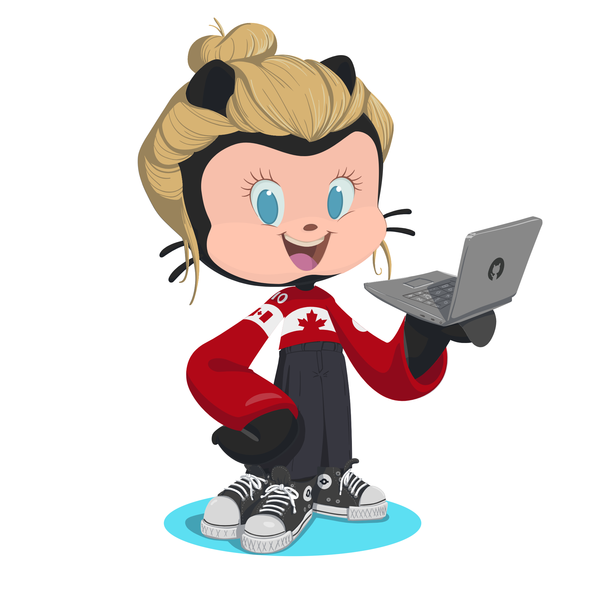

<h2 align="left"> Eu sou a Camila Pedroza! </h2>

  
 
💕 Explorando novas tecnologias e desenvolvendo soluções de software.
  

🎓 Estudando Engenharia de Software na FIAP Paulista (2/8).

  🌱 Aprendendo mais sobre tecnologias FullStack.

  💌 Entre em contato comigo através de: ⤵️

  
  
  

<h3 align="left"> Minhas habilidades: </h3>

**Aplicações e dados**

**DevOps**

**Ferramentas de desenvolvimento**

 

